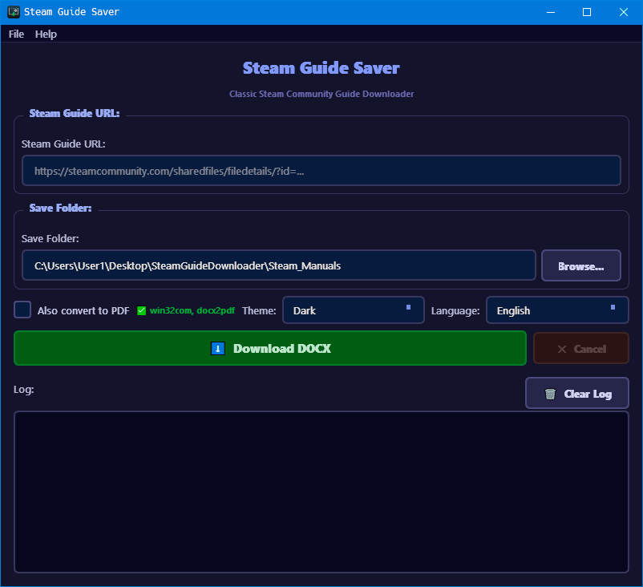
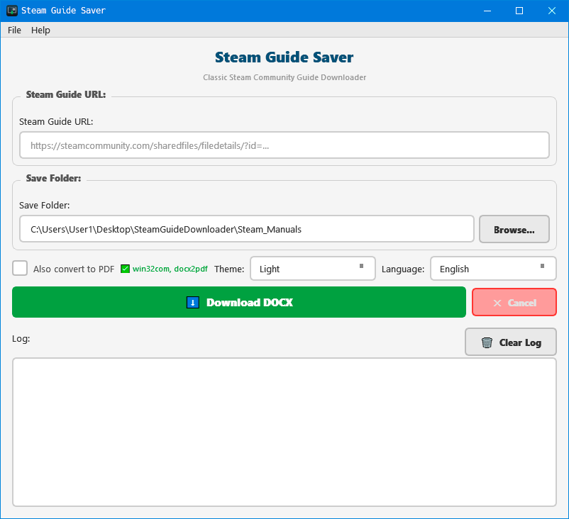
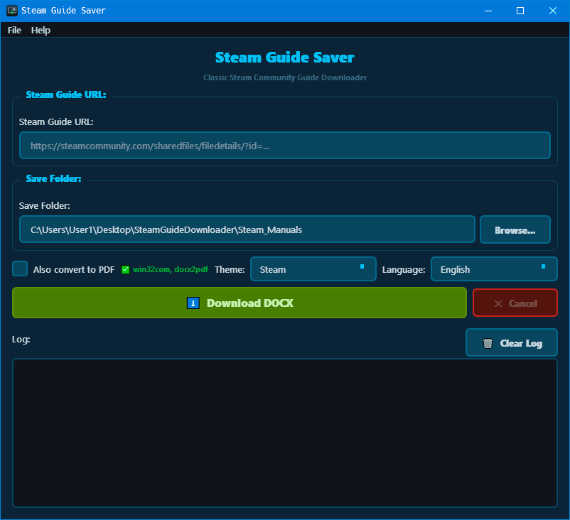
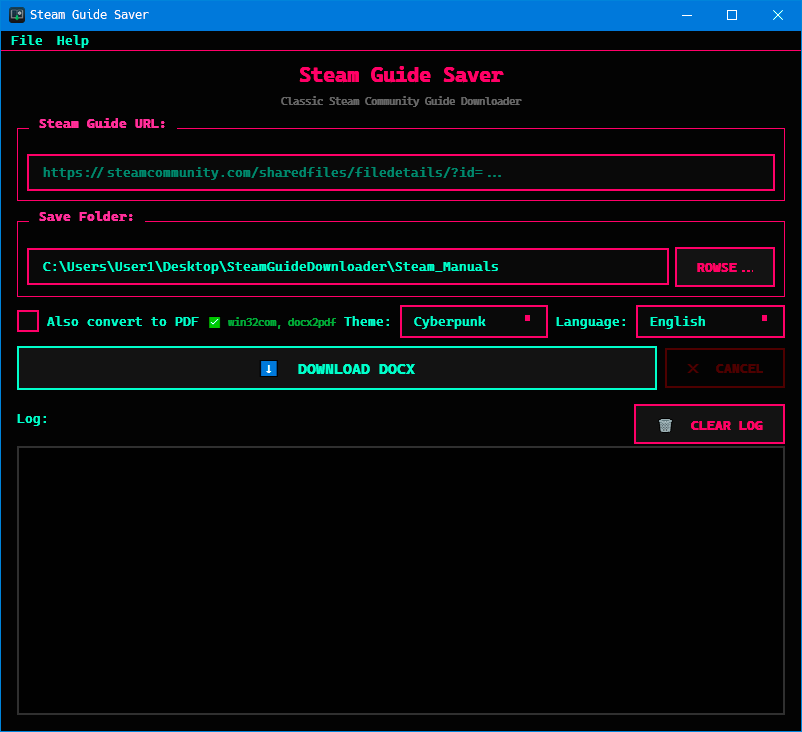

# 🎮 Steam Guide Saver

**Classic Steam Community Guide Downloader**

Downloads Steam Community guides to DOCX format (and optionally PDF)
with full formatting, images, tables, and hyperlinks preserved.


> 🇷🇺 [Описание на русском — ниже](#-описание-на-русском)

---

## ✨ Features

- 📥 Download Steam guides to DOCX
- 📄 Optional PDF conversion (LibreOffice / MS Word)
- 🖼️ All images preserved
- 📊 Tables, lists, blockquotes support
- 🔗 Clickable hyperlinks
- 🎨 4 UI themes (Dark, Light, Steam, Cyberpunk)
- 🌐 English & Russian interface
- ⚡ Image caching
- 🚫 Cancel download anytime
- 📝 Paragraph spacing preserved

## 📸 Screenshots

### Dark Theme


### Light Theme


### Steam Theme


### Cyberpunk Theme


## 🚀 Installation

### Ready-made EXE (Windows)

Download the latest release from
[Releases](https://github.com/qexela/steam-guide-saver/releases) —
no Python required.

### From source

```bash
git clone https://github.com/qexela/steam-guide-saver.git
cd steam-guide-saver
pip install -r requirements.txt
python __main__.py
```

### 📦 Dependencies

```text
PyQt6>=6.5.0
requests>=2.28.0
beautifulsoup4>=4.12.0
python-docx>=0.8.11
Pillow>=9.0.0
```

### Optional (for PDF conversion)

| Method | Install | Platform |
| :--- | :--- | :--- |
| MS Word (pywin32) | `pip install pywin32` | Windows |
| MS Word (comtypes) | `pip install comtypes` | Windows |
| docx2pdf | `pip install docx2pdf` | Windows/Mac |
| LibreOffice | Download manually | All |

## 🔨 Build EXE

```bash
pip install pyinstaller
python build.py
# Result: dist/SteamGuideSaver.exe
```

### Cleanup after build

```bash
# Windows (double-click)
scripts\clean.bat

# PowerShell
powershell -ExecutionPolicy Bypass -File scripts\clean.ps1

# Linux/Mac
chmod +x scripts/clean.sh && ./scripts/clean.sh
```

## 📖 Usage

1. Paste a Steam guide URL
2. Choose save folder
3. Click **Download DOCX**
4. (Optional) Check **Convert to PDF**

### Supported URLs

```text
https://steamcommunity.com/sharedfiles/filedetails/?id=XXXXXXXXX
```

## 🎨 Themes

| Dark | Light | Steam | Cyberpunk |
| :--- | :--- | :--- | :--- |
| Deep blue | Clean white | Steam colors | Neon pink/green |

## 📁 Project Structure

```text
steam-guide-saver/
├── __main__.py          # Entry point
├── gui.py               # PyQt6 interface
├── parser.py            # Guide parsing & download
├── docx_builder.py      # DOCX document builder
├── network.py           # HTTP client & validation
├── pdf_converter.py     # DOCX → PDF conversion
├── config.py            # App configuration
├── translations.py      # i18n (EN/RU)
├── icon_provider.py     # App icon (file or generated)
├── paths.py             # Path resolver (dev/exe)
├── about.py             # About dialog
├── utils.py             # Utilities
├── build.py             # EXE build script
├── themes/              # QSS stylesheets
│   ├── dark.qss
│   ├── light.qss
│   ├── steam.qss
│   └── cyberpunk.qss
├── assets/              # Icons
│   └── icon.png
├── screenshots/         # Screenshots
└── scripts/             # Cleanup scripts
    ├── clean.bat
    ├── clean.ps1
    └── clean.sh
```

## 📝 License

MIT License — see LICENSE

## 👤 Author

**qexela** — [GitHub](https://github.com/qexela)

---

# 🇷🇺 Описание на русском

## 🎮 Загрузчик руководств Steam

**Классический загрузчик руководств Steam Community**

Скачивает руководства из Steam Community в формат DOCX (и опционально PDF)
с сохранением форматирования, изображений, таблиц и гиперссылок.

## ✨ Возможности

- 📥 Скачивание руководств Steam в DOCX
- 📄 Конвертация в PDF (LibreOffice / MS Word)
- 🖼️ Сохранение всех изображений
- 📊 Поддержка таблиц, списков, цитат
- 🔗 Сохранение кликабельных ссылок
- 🎨 4 темы оформления (Тёмная, Светлая, Steam, Киберпанк)
- 🌐 Русский и английский интерфейс
- ⚡ Кеширование изображений
- 🚫 Отмена загрузки в любой момент
- 📝 Сохранение отступов между абзацами

## 📸 Скриншоты

> См. скриншоты в английской секции выше.

## 🚀 Установка

### Готовый EXE (Windows)

Скачайте последнюю версию из раздела
[Releases](https://github.com/qexela/steam-guide-saver/releases) —
Python не требуется.

### Из исходников

```bash
git clone https://github.com/qexela/steam-guide-saver.git
cd steam-guide-saver
pip install -r requirements.txt
python __main__.py
```

### 📦 Зависимости

```text
PyQt6>=6.5.0
requests>=2.28.0
beautifulsoup4>=4.12.0
python-docx>=0.8.11
Pillow>=9.0.0
```

### Опционально (для конвертации в PDF)

| Способ | Установка | Платформа |
| :--- | :--- | :--- |
| MS Word (pywin32) | `pip install pywin32` | Windows |
| MS Word (comtypes) | `pip install comtypes` | Windows |
| docx2pdf | `pip install docx2pdf` | Windows/Mac |
| LibreOffice | Скачать вручную | Все |

## 🔨 Сборка EXE

```bash
pip install pyinstaller
python build.py
# Результат: dist/SteamGuideSaver.exe
```

### Очистка после сборки

```bash
# Windows (двойной клик)
scripts\clean.bat

# PowerShell
powershell -ExecutionPolicy Bypass -File scripts\clean.ps1

# Linux/Mac
chmod +x scripts/clean.sh && ./scripts/clean.sh
```

## 📖 Использование

1. Вставьте ссылку на руководство Steam
2. Выберите папку сохранения
3. Нажмите **Скачать DOCX**
4. (Опционально) Отметьте **Конвертировать в PDF**

### Поддерживаемые ссылки

```text
https://steamcommunity.com/sharedfiles/filedetails/?id=XXXXXXXXX
```

## 🎨 Темы

| Тёмная | Светлая | Steam | Киберпанк |
| :--- | :--- | :--- | :--- |
| Глубокий синий | Чистый белый | Цвета Steam | Неон розовый/зелёный |

## 📝 Лицензия

MIT License — см. LICENSE

## 👤 Автор

**qexela** — [GitHub](https://github.com/qexela)